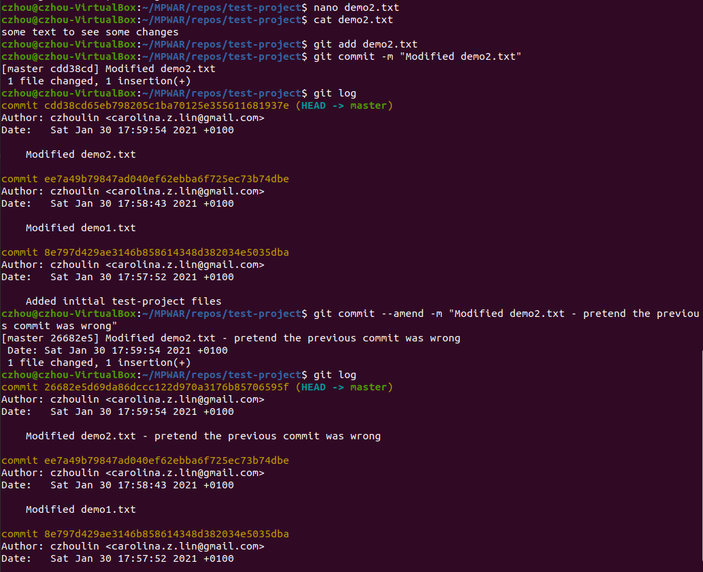
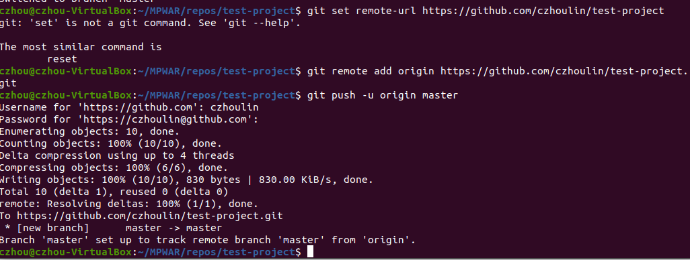

# hw-04-git

## Ejercicio

1. Crea un nuevo proyecto e inicializa git
~~~
mkdir test-project && cd test-project
git init
~~~

2. Añade una regla para ignorar los ficheros de tipo .sh
~~~
nano .gitignore
# *.sh
[save and exit]
~~~

3. Crea dos ficheros vacíos: demo1.txt y demo2.txt. Añade estos ficheros al stage area
~~~
touch demo1.txt demo2.txt
git add demo1.txt demo2.txt
~~~
- A este punto también tendremos para pasar al stage area el fichero .gitignore. 

4. Añade contenido al fichero demo1.txt. A continuación, realiza un commit con el mensaje “Modified demo1.txt”
~~~
nano demo1.txt
# some text to see changes
[save and exit]

git add demo1.txt

git commit -m “Modified demo1.txt”
~~~

5. Añade contenido al fichero demo2. A continuación, realiza un commit con el mensaje “Modified demo3.txt”
~~~
nano demo2.txt
# some text to see changes
[save and exit]

git add demo2.txt

git commit -m “Modified demo3.txt”
~~~

6. Rectifica el commit anterior con el mensaje “Modified demo2.txt”
~~~
git commit --amend -m “Modified demo2.txt”
~~~

7. Crea una nueva rama “develop” y añade un fichero script.sh que imprima por pantalla “Git 101”
~~~
git checkout -b develop

touch script.sh

nano script.sh
# echo “Git 101”
[save and exit]
~~~

8. Da permisos de ejecución al script
~~~
chmod +x script.sh
~~~

9. Realiza un merge (develop -> master) para integrar los cambios
~~~
git status
~~~
- No detectaremos cambios porque inicialmente hemos especificado que se ignoren los archivos .sh
- Si quisiéramos seguir ignorando los archivos .sh con excepción de este script en concreto, podríamos añadir al .gitignore _!script.sh_.
  De esta manera exluiríamos nuestro script de la condición general; detectaríamos el cambio y podríamos mergearlo a master.

10. Sube todos los cambios a tu repositorio remoto
~~~
git remote add origin https://github.com/czhoulin/test-project.git
git push -u origin master
~~~
- Accedemos a GitHub y creamos el repositorio remoto.
- Copiamos la URL generada para pasarla al comando especificado arriba.

11. Ejecutamos el siguiente comando y lo incluimos en el repositorio para ver que todos los cambios solicitados se han realizado:
~~~
git log --oneline > verification.log

git add verification.log
git commit -m "Added verification.log"
git push
~~~

