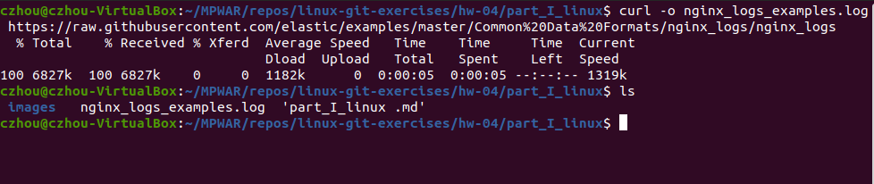
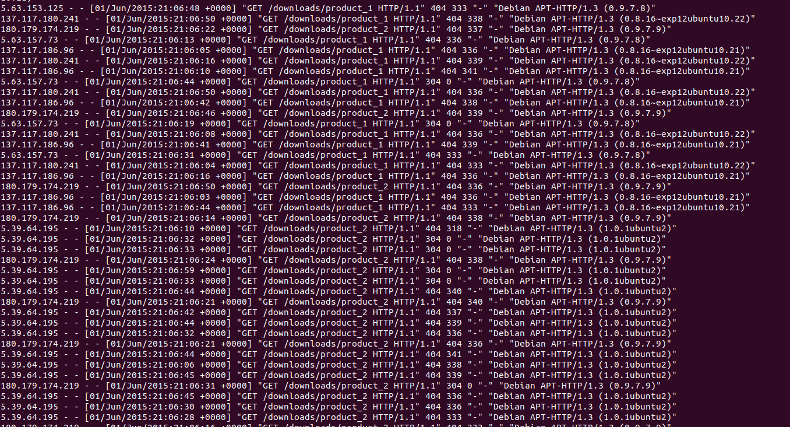
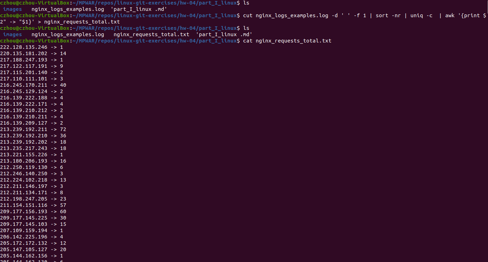
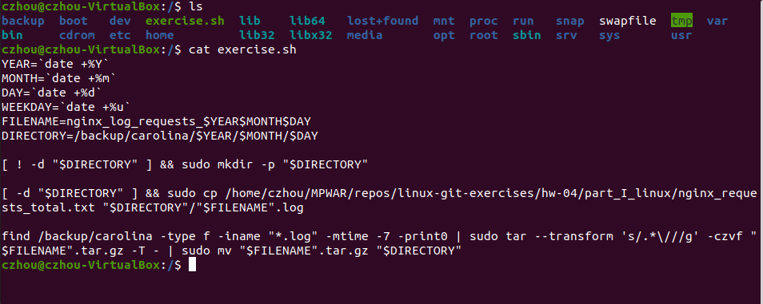
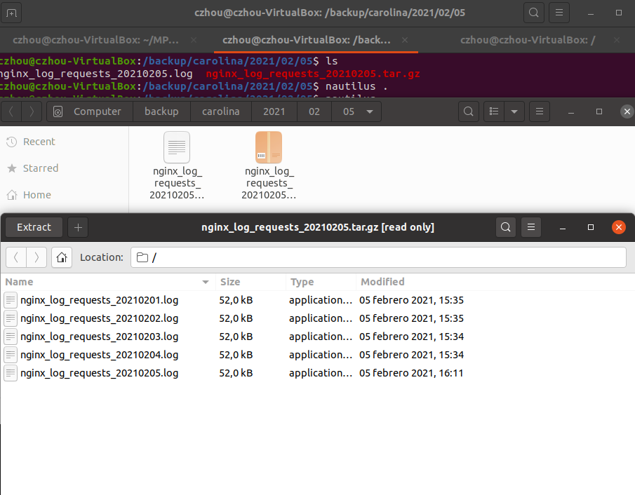

# hw-04-linux

## Ejercicio 1

Obtenemos el fichero con ejemplos de logs de acceso a NGINX:
~~~~
curl -o nginx_logs_examples.log https://raw.githubusercontent.com/elastic/examples/master/Common%20Data%20Formats/nginx_logs/nginx_logs
~~~~
- Vemos el fichero en nuestro directorio

    

- Podemos ver el contenido ejecutando _cat nginx\_logs\_examples.log_

    

Extraemos los datos especificados en el enunciado del ejercicio mediante:
~~~~
cut nginx_logs_examples.log -d ' ' -f 1 | sort -nr | uniq -c  | awk '{print $2" -> "$1}' > nginx_requests_total.txt
~~~~
1. Cortamos [cut] la parte que nos interesa de cada línea del archivo [nginx\_logs\_examples.log], la columna de IPs, que es la primera [-f 1]. Especificamos que el espacio en blanco es el delimitador [-d ' '].
2. Ordenamos [sort] los datos seleccionados por orden numérico [-n] descendiente [-r].
3. Evitamos mostrar los valores repetidos de IP [uniq] y los contamos [-c], agregando el número de ocurrencias de cada IP como prefijo de cada línea 
4. Ahora tenemos solo dos columnas: la primera, el número de ocurrencias; la segunda, la dirección IP. Formateamos la salida según como se espera en el ejercicio [awk '{print $2" -> "$1}]. Con awk podemos referenciar toda la línea; cada columna se acaba guardando por orden en variables (por defecto detecta los espacios en blanco para hacer las separaciones; la variable $0 es toda la línea). La variable $1 guarda el número de ocurrencias y $2 la dirección IP.

    

## Ejercicio 2

Script
~~~
YEAR=`date +%Y`
MONTH=`date +%m`
DAY=`date +%d`
WEEKDAY=`date +%u`
FILENAME=nginx_log_requests_$YEAR$MONTH$DAY
DIRECTORY=/backup/carolina/$YEAR/$MONTH/$DAY

[ ! -d "$DIRECTORY" ] && sudo mkdir -p "$DIRECTORY"

[ -d "$DIRECTORY" ] && sudo cp /home/czhou/MPWAR/repos/linux-git-exercises/hw-04/part_I_linux/nginx_requests_total.txt "$DIRECTORY"/"$FILENAME".log

[ "$WEEKDAY" -eq 7 ] find /backup/carolina -type f -iname "*.log" -mtime -7 -print0 | sudo tar --transform 's/.*\///g' -czvf "$FILENAME".tar.gz -T - | sudo mv "$FILENAME".tar.gz "$DIRECTORY"

~~~
- Extraemos en variables para mayor legibilidad.
- Comprobamos si existe el directorio del día-mes-año correspondiente. Si no existe lo creamos.
- Si existe, copiamos _nginx\_requests\_total.txt_ en dicho directorio con el formato de nombre especificado en el enunciado.
- Si el día de ejecución es un domingo, buscamos todos los archivos modificados los últimos 7 días y los comprimimos en un archivo .tar.gz sin la estructura de directorios-subdirectorios original (queremos visualizar solo los archivos .log).
- Movemos el archivo creado al directorio.

Probamos el script:
- Tenemos el script en el directorio root

    

- Ejecutamos

    

- Vemos el archivo comprimido en el directorio del día

    

    

Para esta prueba rápida se han se han creado otras carpetas con archivos log y se ha eliminado la condición de que comprima cuando sea domingo.

## Ejercicio 3

Si este script lo nombramos "exercise.sh" y está ubicado en /root con los permisos correspondientes para la ejecución (_sudo chmod +x exercise.sh_):

~~~
crontab -e

// add the task and save:
59 23 * * 1-0 root /./exercise.sh
~~~

Se ejecutará la tarea:
- minuto 59
- hora 23
- cada día del mes
- cada mes
- de lunes a domingo